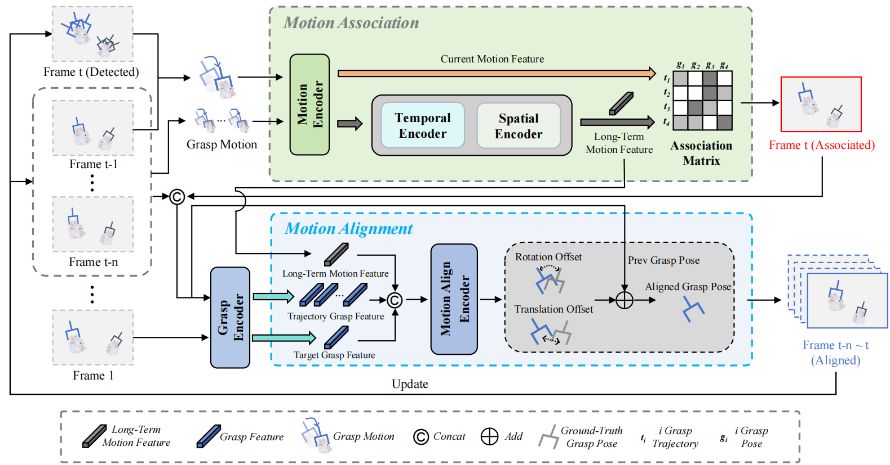

# MotionGrasp: Long-Term Grasp Motion Tracking for Dynamic Grasping

The official implementation of MotionGrasp | [Paper](https://ieeexplore.ieee.org/document/10764717)

Nuo Chen&, Xiao-Ming Wu&, Guohao Xu, Jian-Jian Jiang, Zibo Chen, Wei-Shi Zheng*

<center>
<figure>


</figure>
</center>

## Abstract
Dynamic grasping, which aims to grasp moving objects in unstructured environment, is crucial for robotics community. Previous methods propose to track the initial grasps or objects by matching between the latest two frames. However, this neighbour-frame matching strategy ignores the long-term historical trajectory in tracking, resulting in accumulated error. To address this, we present a novel dynamic grasping framework, delicately taking the long-term trajectory into account in grasp tracking. To model the long-term trajectory well, we introduce the concept of Grasp Motion, the changes of grasps between frames, endowing the model with the dynamic modeling ability. Benefiting from the Grasp Motion, we are able to conduct accurate motion association, which associates the grasp generated in current frame to the long-term grasp trajectory and mitigates accumulated error. Moreover, since the generated grasps in current frame may not precisely align with the ground-truth grasp for the trajectory, which results in deviation when we put it into the trajectory for future association, we further design a motion alignment module to compensate it. Our experiments show that the MotionGrasp achieves great grasping performance in dynamic grasping, obtaining 20% increase compared to the previous SOTA method in the large-scale GraspNet-1billion dataset. Our experiments also verify that Grasp Motion is a key to the success of long-term modeling. The real-world experiments further verify the effectiveness of our method.

## Pipeline


## Dependencies Installation
Please follow the instructions below to prepare your running environment.

### Create Python Environment
```
conda create -n motiongrasp python=3.8
conda activate motiongrasp
```

### Install Pytorch
```
pip install torch==1.8.0+cu111 torchvision==0.9.0+cu111 -f https://download.pytorch.org/whl/torch_stable.html
```

### Install Packages
```
cd MotionGrasp
pip install -r requirements.txt
```

### Install Numpy
Mismatched version of numpy may be conflicted with graspnetAPI.
```
pip install numpy==1.23.4
```
### Install Knn
Compile and install knn operators.
```
cd knn
python setup.py install
```

### Install Pointnet
Compile and install pointnet2 operators.
```
cd pointnet2
python setup.py install
```

### Install TrackEval
Install TrackEval for evaluation.
```
cd eval
git clone https://github.com/JonathonLuiten/TrackEval.git
cd TrackEval
pip install -e .
```
## Dataset and Checkpoint Download
### GraspNet Checkpoint Download
Please download the GraspNet-1Billion Baseline model checkpoint trained using RealSense data. 

You can download it here. [[Google Drive](https://drive.google.com/file/d/1hd0G8LN6tRpi4742XOTEisbTXNZ-1jmk/view?usp=sharing)] [[Baidu Pan](https://pan.baidu.com/s/1Eme60l39tTZrilF0I86R5A)]

After downloading it, save it to the path `logs/log_rs`
```
mkdir logs
cd logs
mkdir log_rs
```

### Trainset Download
Please download the GraspNet-1Billion dataset for training. You can download it [here](https://graspnet.net/datasets.html).

### Testset Generation
Please follow the instructions below to create the testset by processing the downloaded GraspNet-1Billion dataset. 
```
cd dataset
python split_1billion.py --data_dir /data/GraspNet_1billion --billion_dir /data/one_billion
```
You can set your dataset path by modifying the `data_dir` and `billion_dir`.

## Training
We use PyTorch DistributedDataParallel(DDP) to run our model on multiple GPUs.
Run the command below to use ddp training.
```
cd scripts
sh command_train_ddp.sh
```
It is also available to train on a single GPU. Run the command below, simply reducing the number of GPUs to 1.
```
sh command_train.sh
```

## Evaluation
The first thing to do is to generate grasp tracking targets. We generate 10 grasps in the first frame for each sequence.
```
cd scripts
sh command_make.sh
```
After generating grasp tracking targets, you can run the model to infer each following frame and save inference results.
```
sh command_test.sh
```
For evaluation, run the following commands to get the evaluation results on 3 testsets respectively.
```
# seen
sh command_evalseen.sh
# similar
sh command_evalsimilar.sh
# novel
sh command_evalnovel.sh
```

## Results
We have tested our performance on NVIDIA GeForce RTX 3090 and NVIDIA V100 TENSOR CORE GPU respectively using the released code.

Evaluation results on Realsense camera:
|                |      | Seen  |         |      | Similar |         |      | Novel |         | 
|:--------------:|:----:|:-----:|:-------:|:----:|:-------:|:-------:|:----:|:-----:|:-------:|
|                | MGTA | n(cm) |n($\circ$)| MGTA |  n(cm)  |n($\circ$)| MGTA | n(cm) |n($\circ$)|
|    In paper    | 0.99 |  1.1  |  0.86   | 0.99 |   1.1   |  0.84   | 0.99 | 1.07  |  1.12   |
|  In repo(3090) | 0.99 | 1.07  |  1.25   | 0.99 |  1.04   |  1.27   | 0.99 | 1.03  |  1.45   |
|  In repo(V100) | 0.99 | 1.06  |  1.26   | 0.99 |  1.05   |  1.29   | 0.99 | 1.06  |  1.45   |


## Notes
1. If you encounter cuda error when you install the pointnet2, [this](https://github.com/mkt1412/GraspGPT_public/issues/8
) may help you.
2. If you have any questions, feel free to contact me by chenn65@mail2.sysu.edu.cn.

## Citation
```
@ARTICLE{chen2025motiongrasp,
  title={MotionGrasp: Long-Term Grasp Motion Tracking for Dynamic Grasping},
  author={Chen, Nuo and Wu, Xiao-Ming and Xu, Guohao and Jiang, Jian-Jian and Chen, Zibo and Zheng, Wei-Shi},
  journal={IEEE Robotics and Automation Letters},
  year={2025},
  volume={10},
  number={1},
  pages={796-803},
}
```
